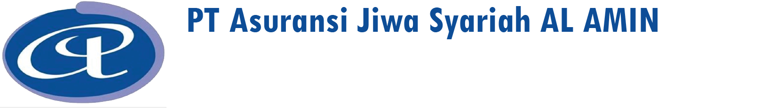

## Migrasi Sistem Internal PT Asuransi Jiwa Syariah AL AMIN

PT. Asuransi Jiwa Syariah AL AMIN merupakan perusahaan asuransi jiwa murni syariah yang menaruh perhatian bagi perkembangan perasuransian di Indonesia khususnya perkembangan dan kebutuhan masyarakat untuk dapat bermuamalah berdasarkan syariah Islam. Pemilihan nama Perusahaan didasarkan atas pertimbangan dan pengetahuan kami mengenai karakteristik industri perasuransian sebagai "bisnis kepercayaan". Komitmen kami untuk memenuhi perjanjian perlindungan asuransi syariah kepada Peserta Yang Diasuransikan dan/atau Pemegang Polis telah menjadi filosofi kami untuk berpegang teguh kepada prinsip-prinsip syariah Islam dan prinsip-prinsp asuransi terutama prinsip utmost good faith. Dengan komitmen kami yang dilandasi oleh itikad baik untuk menjalankan fungsinya dan kegiatan usaha secara sehat sesuai dengan ketentuan yang berlaku telah menjadi konsep dasar yang melatar belakangi nama Perusahaan, yaitu "AL AMIN" yang berarti "Terpercaya".

## Al Amin Core - Clone
- git clone https://gitlab.com/akhmad.dharma.kasman/alamin_dev_blade.git
- cp .env.exampe .env
- composer install/ composer update
- npm install
- php artisan migrate <i>yang ini di skip gpp<i/>
- php artisan serve

## Documentation Metronic
- Link Documentation Alamin Blade https://preview.keenthemes.com/html/metronic/docs/index

## License

The Laravel framework is open-sourced software licensed under the [MIT license](https://opensource.org/licenses/MIT).
